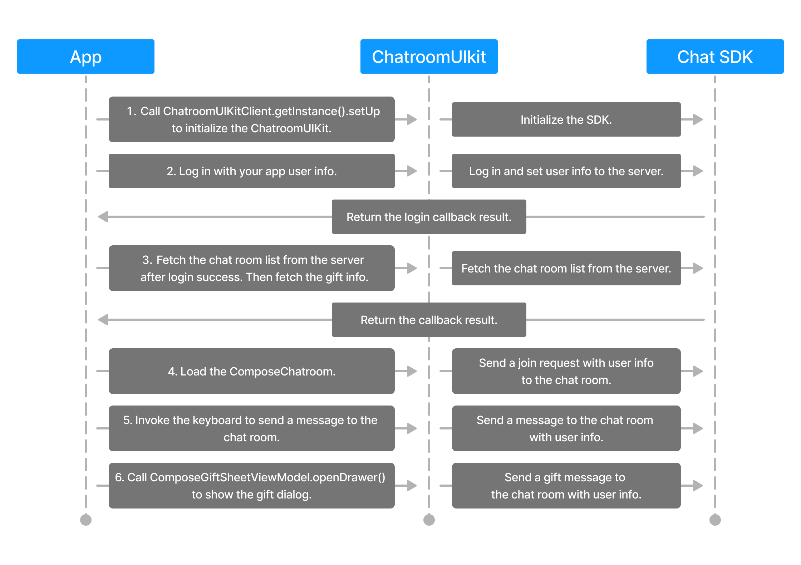

# 聊天室 UIKit

本产品主要为了解决泛娱乐业务场景下对聊天室的需求，通过对 Chat SDK 的封装，为用户简洁友好的 API 。

--------

# 示例演示


# 聊天室 UIKit 指南

## 简介
本指南介绍了 ChatroomUIKit 框架在 Android 开发中的概述和使用示例，并描述了该 UIKit 的各个组件和功能，使开发人员能够很好的了解 UIKit 并有效地使用。
## 目录


## 环境准备
- 有效的 [Chat 账号](https://console.easemob.com/user/register)。
- 开发环境
  - Android Studio Arctic Fox (2020.3.1) 或更高版本
  - Android API 最低支持 24 。
  - 使用 Kotlin 语言开发，1.5.21及以上版本。
  - JDK 1.8 及以上版本。
  - Gradle 7.0.0 及以上版本。

## 集成 UIKit
### 1. 克隆本仓库到本地
```shell
 git clone [本项目地址]
```
### 2. 将 [ChatroomUIKit](./ChatroomUIKit) 和 [ChatroomService](./ChatroomService) 模块导入到项目中
```kotlin
// settings.gradle
include ':ChatroomUIKit'
project(':ChatroomUIKit').projectDir = new File('../ChatroomUIKit/ChatroomUIKit')

// app/build.gradle
dependencies {
  implementation(project(mapOf("path" to ":ChatroomUIKit")))
}
```

# 结构

## UIKit 项目结构
```
┌─ Example                              // SampleDemo directory
│  ├─ ChatroomListActivity              // Mainly providing room list Activity
│  ├─ ChatroomActivity                  // display ChatroomUIKit chatroom Activity
│  ├─ compose                           // SampleDemo 
│  ├─ http                              // Encapsulated network requests for interaction with app services
│  └─ SplashActivity                    // Program Launch Page
└─ ChatroomUIKit            
       ├─ compose                        // UI Compose(Bottom input box, message list, gift list, bottom drawer)
       ├─ service                        // The protocols and protocol implementations used by ChatroomUIKit (room protocol, user protocol, gift protocol)
       │     ├─ model                    // The entity objects used by ChatroomUIKit (user, room information, configuration information)
       │     ├─ Protocol
       │     │      ├─ GiftService      // Gift sending and receiving channel.
       │     │      ├─ UserService      // Component for user login and user attribute update.
       │     │      └─ ChatroomService  // Component for implementing the protocol for chat room management, including joining and leaving the chat room and sending and receiving messages.
       │     └─ ChatroomUIKitClient     // ChatroomUIKit initialization class.
       ├─ theme                          // Resource files provide properties such as colors, fonts, themes, gradients, and sizes required for the project
       ├─ viewModel                      // data processing
       ├─ widget                         // input widget
       └─ ui                             // search activity
```

# 快速开始

### 一、初始化 ChatroomUIKit

进行这一步的时候，需要先在 [环信管理后台](https://console.easemob.com/user/register) 创建您自己的应用并获取到 AppKey。

```kotlin
// 初始化 ChatroomUIKit   
class ChatroomApplication : Application() {

  override fun onCreate() {
    super.onCreate()

    ChatroomUIKitClient.getInstance().setUp(this, "Your AppKey")

  }
}
```

### 二、登录

```kotlin
ChatroomUIKitClient.getInstance().login(
    userId = userId, 
    token = token, 
    onSuccess = {
        // 处理登录成功的逻辑
    }, 
    onError = { code, errorMessage -> 
        // 处理登录失败的逻辑    
    }
)
```

### 三、加入聊天室

加入聊天室需要传入聊天室的 ID 和聊天室的所有者 ID。
开发者可以在 [环信管理后台](https://console.easemob.com/user/register) 创建聊天室并获取到聊天室的 ID 和聊天室的所有者 ID。
具体操作步骤为：选择“项目管理 > 运营管理 > 聊天室”，单击“创建聊天室”，在弹出的对话框中设置参数，创建聊天室。

```kotlin
ChatroomUIKitClient.getInstance().joinChatroom(
    roomId = roomId, 
    ownerId = roomOwnerId, 
    onSuccess = { chatroom ->
       // 处理加入聊天室成功的逻辑         
    }, 
    onError = { code, errorMessage ->
       // 处理加入聊天室失败的逻辑 
    }
)
```
UIKit中将加入聊天室的 API 放在了 ComposeChatScreen 组件中，开发者在使用时可以直接使用该组件。


# 进阶用法

### 1.初始化 ChatroomUIKIT 的配置项
相比于上面快速开始的聊天室UIKit初始化这里多了ChatOptions的参数，主要是对SDK中是否打印log以及是否自动登录，是否默认使用用户属性的开关配置。
```kotlin
// 初始化 ChatroomUIKit
val chatOptions = ChatSDKOptions(
  enableDebug = true,       // 是否打印调试日志
  autoLogin = true,         // 是否自动登录
  useUserProperties = true  // 是否使用 Chat SDK 提供的用户属性接口获取用户属性
)

val options = ChatroomUIKitOptions(chatOptions)

ChatroomUIKitClient.getInstance().setUp(
  applicationContext = this,
  appKey = "Your AppKey",
  options = options)
```

### 2.登录时传入用户信息

```kotlin
ChatroomUIKitClient.getInstance().login(
    user = UserInfoProtocol(
        userId = userId,
        nickName = nickname,
        avatarURL = "avatar url",
        gender = gender,
    ),
    token = token,
    onSuccess = {
        // 处理登录成功的逻辑
    },
    onError = { code, errorMessage ->
        // 处理登录失败的逻辑
    }
)
```

### 3.监听 ChatroomUIKIT 事件
您可以调用`registerRoomResultListener`方法来监听 ChatroomUIKit 事件和错误。
```kotlin
val roomResultListener: ChatroomResultListener = object : ChatroomResultListener {
  override fun onEventResult(
    event: ChatroomResultEvent,
    errorCode: Int,
    errorMessage: String?
  ) {
    // 处理事件回调
    // 1. errorCode = ChatError.EM_NO_ERROR, 表示事件处理成功
    // 2. errorCode != ChatError.EM_NO_ERROR, 表示事件处理失败，需要根据errorCode和errorMessage做相应的处理
  }
}
// 注册事件回调监听
ChatroomUIKitClient.getInstance().registerRoomResultListener(roomResultListener)
// 取消注册事件回调监听
// 在不使用事件回调监听时，需要调用该方法取消注册，避免内存泄漏
ChatroomUIKitClient.getInstance().unregisterRoomResultListener(roomResultListener)
```

# 自定义

## 1.修改可配置项

```kotlin
// 通过 UiOptions 配置 举例： UiOptions 中可以配置 礼物是否在消息列表中展示等
val chatroomUIKitOptions = ChatroomUIKitOptions(
      uiOptions = UiOptions(
      targetLanguageList = listOf(GlobalConfig.targetLanguage.code),
      useGiftsInList = false,
    )
)

// 通过 ViewModel 配置 举例：MessageListViewModel 中可以配置是否显示时间、头像等
class MessageListViewModel(
  private val isDarkTheme: Boolean? = false,
  private val showDateSeparators: Boolean = true,
  private val showLabel: Boolean = true,
  private val showAvatar: Boolean = true,
  private val roomId: String,
  private val chatService: UIChatroomService,
  private val composeChatListController: ComposeChatListController
)
```

## 2.自定义主题
ChatroomUIKitTheme 提供了可配置项，开发者只要替换对应的配置项即可实现自定义主题。如果不配置，则使用默认的主题。
```kotlin
@Composable
fun ChatroomUIKitTheme(
    isDarkTheme: Boolean = isSystemInDarkTheme(),
    colors: UIColors = if (!isDarkTheme) UIColors.defaultColors() else UIColors.defaultDarkColors(),
    shapes: UIShapes = UIShapes.defaultShapes(),
    dimens: UIDimens = UIDimens.defaultDimens(),
    typography: UITypography = UITypography.defaultTypography(),
    content: @Composable () -> Unit
)
```

# 业务流程


# API 时序图


# 设计指南
关于[设计指南](https://www.figma.com/file/OX2dUdilAKHahAh9VwX8aI/Streamuikit?node-id=137)和细节的任何问题，您可以在Figma设计草案中添加评论，并提及我们的设计师Stevie Jiang。
