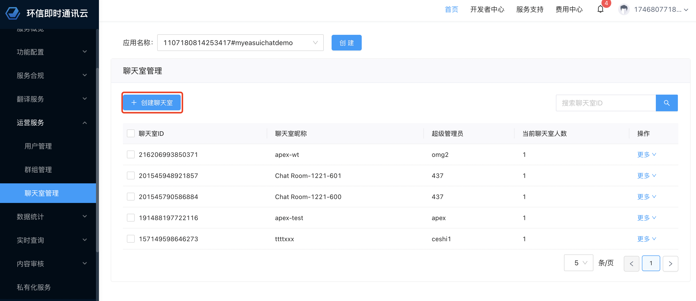

# ChatroomUIKit

*English | [英文](ChatroomUIKit.md)*

# [Demo](../app)

在该项目中，我们在 `Example` 文件夹中提供了最佳实践示范项目，帮助你构建业务能力。

你可以扫描以下二维码体验 demo：

[](../image/demo.png).

# [ChatroomUIKit 集成指南](../document/ChatroomUIKit_zh.md#chatroomuikit-集成指南)

## [概述](../document/ChatroomUIKit_zh.md#概述)

本指南介绍了 ChatroomUIKit 框架在 Android 开发中的概述和使用示例，描述了该 UIKit 的各个组件和功能，使开发人员能够很好地了解 UIKit 并有效地使用。

## [目录](../document/ChatroomUIKit_zh.md#目录)

- [前提条件](../document/ChatroomUIKit_zh.md#前提条件)
- [安装](../document/ChatroomUIKit_zh.md#安装)
- [架构](../document/ChatroomUIKit_zh.md#架构)
- [快速开始](../document/ChatroomUIKit_zh.md#快速开始)
- [进阶用法](../document/ChatroomUIKit_zh.md#进阶用法)
- [自定义](../document/ChatroomUIKit_zh.md#自定义)
- [业务流程](../document/ChatroomUIKit_zh.md#业务流程)
- [API 时序图](../document/ChatroomUIKit_zh.md#api-时序图)
- [设计指南](../document/ChatroomUIKit_zh.md#设计指南)
- [贡献](../document/ChatroomUIKit_zh.md#贡献)
- [许可证](../document/ChatroomUIKit_zh.md#许可证)

# [前提条件](../document/ChatroomUIKit_zh.md#前提条件)

- Jetpack Compose 需使用 Android API 级别 21（Android 5.0）及以上
- Android Studio Arctic Fox 2020.3.1 及以上
- 使用 kotlin 语言
- JDK 1.8 及以上
- Gradle 7.0.0 及以上

# [安装](../document/ChatroomUIKit_zh.md#安装)

你可以通过 build.gradle 导入 ChatroomUIKi库，作为 app 项目的依赖。

## [ChatroomUIKi仓库地址](https://github.com/easemob/UIKit_Chatroom_android)

## [本地模块依赖](../document/ChatroomUIKit_zh.md#本地模块依赖)

找到 **ChatroomUIKit** 模块，将 [ChatroomUIKit](../ChatroomUIKit)模块导入到项目中，或者使用package文件夹下的ease-chatroomui-kit.aar。

1. 在 Android Studio 中打开你的项目。

2. 选择 **File** > **import Module**.

3. 查找并选择 **ChatroomUIKit**。

```
// settings.gradle
include ':ChatroomUIKit'
project(':ChatroomUIKit').projectDir = new File('../ChatroomUIKit/ChatroomUIKit')

// app/build.gradle
dependencies {
  implementation(project(mapOf("path" to ":ChatroomUIKit")))
}
```

## [远程模块依赖](../document/ChatroomUIKit_zh.md#远程模块依赖)

将以下代码添加到 build.gradle 中：

```
implementation 'ChatroomUIKit'
```

# [架构](../document/ChatroomUIKit_zh.md#架构)

### [ChatroomUIKit 基本组件](../document/ChatroomUIKit_zh.md#chatroomuikit-基本组件)

```
┌─ Example                               // Demo 目录。
│  ├─ ChatroomListActivity               // 主要提供聊天室列表 Activity。
│  ├─ ChatroomActivity                   // 显示 ChatroomUIKit 聊天室 Activity。
│  ├─ compose                            // Demo。
│  ├─ http                               // 封装的网络请求，用于与 app 服务进行交互。
│  └─ SplashActivity                     // 程序启动页面。
└─ ChatroomUIKit            
       ├─ compose                        // UI Compose （聊天室底部工具栏区域、消息列表、礼物列表和底部抽屉）
       ├─ service                        // ChatroomUIKit 协议模块。
       │     ├─ model                    // ChatroomUIKit 使用的实体对象（用户、聊天室信息和配置信息）。
       │     ├─ Protocol
       │     │      ├─ GiftService       // 礼物发送和接收频道。
       │     │      ├─ UserService       // 用于用户登录和用户属性更新的组件。
       │     │      └─ ChatroomService   // 用于实现聊天室管理协议的组件，包括加入和离开聊天室和发送和接收消息。
       │     └─ ChatroomUIKitClient      // ChatroomUIKit 初始化类。
       ├─ theme                          //资源文件，提供项目所需的各种属性，例如颜色、字体、主题、渐变和大小。
       ├─ viewModel                      // 数据处理。
       ├─ widget                         // 输入组件。
       └─ ui                             // 搜索 Activity。
```
# [快速开始](../document/ChatroomUIKit_zh.md#快速开始)

本节介绍 ChatroomUIKit 各种组件的使用示例。`Examples` 文件夹中介绍了详细的代码和各种用例的项目。

按以下步骤在 Android Studio 中运行 Android 平台应用：
1. 下载 Demo，保存到本地文件。
2. 找到根目录下的 `local.properties` 文件夹，配置 `CHATROOM_APP_KEY` 和 `REQUEST_HOST`。
3. 运行 Demo。

### [步骤 1 初始化 ChatroomUIKit](../document/ChatroomUIKit_zh.md#步骤-1-初始化-chatroomuikit)

```kotlin
class ChatroomApplication : Application() {
    override fun onCreate() {

        val chatroomUIKitOptions = ChatroomUIKitOptions(
            uiOptions = UiOptions(
                targetLanguageList = listOf(GlobalConfig.targetLanguage.code),
                useGiftsInList = false,
            )
        )

        ChatroomUIKitClient.getInstance().setUp(
            applicationContext = this,
            options = chatroomUIKitOptions,
            appKey = BuildConfig.CHATROOM_APP_KEY
        )
    }
}
```

### [步骤 2 登录 ChatroomUIKit](../document/ChatroomUIKit_zh.md#步骤-2-登录-chatroomuikit)

```kotlin
// 利用符合 `UserInfoProtocol` 协议的当前用户对象中的用户信息，登录 ChatroomUIKit。
// 关于如何在环信控制台上生成用户，详见 https://docs-im-beta.easemob.com/document/server-side/enable_and_configure_IM.html#创建-im-用户。
// 从你的 app server 中获取 token，也可以在环信控制台的应用概述 > 用户认证页面获取临时 token 登录。
ChatroomUIKitClient.getInstance().login("user id","token")
```

### [步骤 3 创建聊天室](../document/ChatroomUIKit_zh.md#步骤-3-创建聊天室)

```kotlin
// 1. 获取聊天室列表，加入聊天室。或者，在环信控制台创建聊天室。详见 https://docs-im-beta.easemob.com/document/server-side/enable_and_configure_IM.html#创建聊天室。
// 2. 加载完整封装的聊天室场景组件 ComposeChatroom。
// 3. 设置 ComposeChatroom 所需的参数。
// 4. 在环信控制台上，将用户添加到聊天室中。详见 https://docs-im-beta.easemob.com/document/server-side/enable_and_configure_IM.html#创建聊天室。
// 5. 加载 ComposeChatroom 视图，传入聊天室的 roomId 和聊天室所有者的 UserEntity 对象。
class ChatroomActivity : ComponentActivity(){
    override fun onCreate(savedInstanceState: Bundle?) {
        super.onCreate(savedInstanceState)
        setContent {
            ComposeChatroom(roomId = roomId,roomOwner = ownerInfo)
        }
    }
}
```

[](../image/CreateChatroom.png).

# [进阶用法](../document/ChatroomUIKit_zh.md#进阶用法)

本节介绍三个进阶用法。

### [1.初始化聊天室 compose](../document/ChatroomUIKit_zh.md#1初始化聊天室-compose)

```kotlin
    val chatroomUIKitOptions = ChatroomUIKitOptions(
    chatOptions = ChatSDKOptions(),
    uiOptions = UiOptions(
        targetLanguageList = listOf(GlobalConfig.targetLanguage.code),
        useGiftsInList = false,
    )
)

ChatroomUIKitClient.getInstance().setUp(applicationContext = applicationContext,appKey = "Your AppKey",options = chatroomUIKitOptions)
```

### [2.登录 ChatroomUIKit](../document/ChatroomUIKit_zh.md#2登录-chatroomuikit)

```kotlin
class YourAppUser: UserInfoProtocol {
    var userId: String = "your application user id"

    var nickName: String = "you user nick name"

    var avatarURL: String = "you user avatar url"

    var gender: Int = 1

    var identity: String =  "you user level symbol url"

}
// 利用符合 `UserInfoProtocol` 协议的当前用户对象中的用户信息，登录 ChatroomUIKit。
// 从你的 app server 中获取 token，也可以在环信控制台的应用概述 > 用户认证页面获取临时 token 登录。
ChatroomUIKitClient.getInstance().login(YourAppUser, token, onSuccess = {}, onError = {code,error ->})
```

### [3.监听 ChatroomUIKit 事件和错误](../document/ChatroomUIKit_zh.md#3监听-chatroomuikit-事件和错误)

你可以调用 `registerRoomResultListener` 方法监听 ChatroomUIKit 事件和错误。

```kotlin
ChatroomUIKitClient.getInstance().registerRoomResultListener(this)
```

# [自定义](../document/ChatroomUIKit_zh.md#自定义)

### [修改可配置项](../document/ChatroomUIKit_zh.md#修改可配置项)

```kotlin
// 修改 UiOptions 中的可配项。例如，你可以修改 UiOptions 中的 useGiftsInList 配置消息列表上是否显示礼物。
val chatroomUIKitOptions = ChatroomUIKitOptions(
      uiOptions = UiOptions(
      targetLanguageList = listOf(GlobalConfig.targetLanguage.code),
      useGiftsInList = false,
    )
)

// 修改 ViewModel 中的可配项。例如，你可以修改 MessageListViewModel 中的可配项，配置是否显示时间和头像。
class MessageListViewModel(
  private val isDarkTheme: Boolean? = false,
  private val showDateSeparators: Boolean = true,
  private val showLabel: Boolean = true,
  private val showAvatar: Boolean = true,
  private val roomId: String,
  private val chatService: UIChatroomService,
  private val composeChatListController: ComposeChatListController
)
```

### [自定义主题](../document/ChatroomUIKit_zh.md#自定义主题)

你可以通过更新主题相关的配置项来自定义主题。若对任何配置项不做修改，可以使用默认主题。

```kotlin
@Composable
fun ChatroomUIKitTheme(
    isDarkTheme: Boolean = isSystemInDarkTheme(),
    colors: UIColors = if (!isDarkTheme) UIColors.defaultColors() else UIColors.defaultDarkColors(),
    shapes: UIShapes = UIShapes.defaultShapes(),
    dimens: UIDimens = UIDimens.defaultDimens(),
    typography: UITypography = UITypography.defaultTypography(),
    content: @Composable () -> Unit
)
```

# [业务流程](../document/ChatroomUIKit_zh.md#业务流程)

下图为整个业务请求和回调逻辑。


# [API 时序图](../document/ChatroomUIKit_zh.md#api-时序图)

下图为 `Example` 项目中的最佳实践 API 调用时序图。


# [设计指南](../document/ChatroomUIKit_zh.md#设计指南)

关于设计指南和细节中的任何问题，可以在 Figma 设计稿中添加标注，然后 @ 我们的设计师 Stevie Jiang。

- [UI 设计稿](https://www.figma.com/file/OX2dUdilAKHahAh9VwX8aI/Streamuikit?node-id=137%3A38589&mode=dev).

- [UI 设计指南](https://www.figma.com/file/OX2dUdilAKHahAh9VwX8aI/Streamuikit?node-id=137)

# [贡献](https://github.com/easemob/UIKit_Chatroom_android#贡献)

我们随时欢迎各种形式的贡献和建议。如有任何问题或改进意见，你可以创建问题或提交 PR。

## [作者](../document/ChatroomUIKit_zh.md#作者)

apex-wang, [1746807718@qq.com](mailto:1746807718@qq.com)

## [许可证](../document/ChatroomUIKit_zh.md#许可证)

ChatroomUIKit 采用 MIT 许可证。如欲了解更多信息，请参阅许可证文件。
